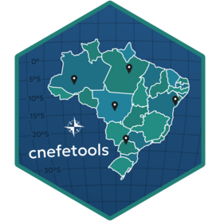

---
output:
  github_document:
    html_preview: false
---

# cnefetools: Tools for working with Brazilian CNEFE 2022 Address Data 

[](https://github.com/pedreirajr/cnefetools/actions/workflows/R-CMD-check.yaml) [](LICENSE.md)

**{cnefetools}** provides helper functions to work with the 2022 Brazilian National Address File for Statistical Purposes (*Cadastro Nacional de Endereços para Fins Estatísticos*, CNEFE), an address-level dataset released by the Brazilian Institute of Geography and Statistics (*Instituto Brasileiro de Geografia e Estatística*, IBGE).\
The current version focuses on efficiently downloading, caching, and reading municipality-level CNEFE CSV files into Arrow tables or `sf` objects for downstream analysis.

## Installation

``` r
# install.packages("pak")
pak::pak("pedreirajr/cnefetools")
```

## Basic usage

``` r
library(cnefetools)

# Example: read CNEFE data for a municipality (Salvador) as an Arrow table
tab_ssa <- read_cnefe(2927408, cache = TRUE)

# Convert to a data frame for inspection
df_ssa <- tab_ssa %>%
  as.data.frame()

head(df_ssa)
```

## Spatial output and quick map

If you prefer to work with spatial objects, `read_cnefe()` can return an `sf` object by setting `output = "sf"`.\
The example below reads CNEFE data for Salvador, filters only religious facilities (`COD_ESPECIE == 8`), and plots them with `ggplot2`:

``` r
library(cnefetools)
library(sf)
library(ggplot2)
library(dplyr)

# Read CNEFE data as sf (Salvador, IBGE code = 2927408)
tab_ssa_sf <- read_cnefe(code_muni = 2927408, output = "sf", cache = TRUE)

# Keep only religious facilities (COD_ESPECIE == 8)
templos_ssa <- tab_ssa_sf %>%
  dplyr::filter(COD_ESPECIE == 8)

ggplot() +
  geom_sf(data = templos_ssa, size = 0.3, alpha = 0.6) +
  coord_sf() +
  theme_minimal()
```

> **Warning**\
> For large municipalities, CNEFE may contain more than 1 million address points.\
> Plotting all coordinates at once can be slow and memory intensive, so consider filtering by area of interest or sampling points before creating maps.

## Caching behavior

By default, `cache = TRUE` stores the downloaded ZIP file in a user-level cache directory specific to this package.\
The exact location is handled internally via:

``` r
tools::R_user_dir("cnefetools", "cache")
```

If you prefer to avoid persistent caching, set:

``` r
tab_ssa <- read_cnefe(code_muni = 2927408, cache = FALSE)
```

In this case, the ZIP file is stored in a temporary location and removed after reading.

## Accessing official CNEFE documentation

**cnefetools** includes local copies of the official methodological note and the variable dictionary for the 2022 CNEFE released by IBGE.

You can open these documents in your default PDF and spreadsheet viewers with:

``` r
# Open the official methodological note (PDF)
cnefe_doc()

# Open the official variable dictionary (Excel)
cnefe_dictionary()
```

## Roadmap

Planned extensions include:

-   Functions to compute land use mix indicators based on CNEFE records.\
-   Functions to support dasymetric population interpolation using CNEFE as ancillary data.\
