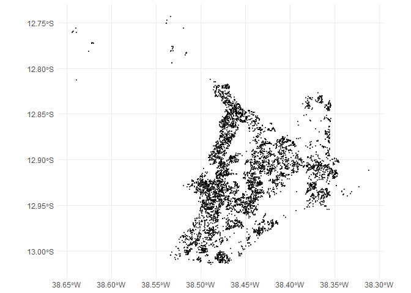
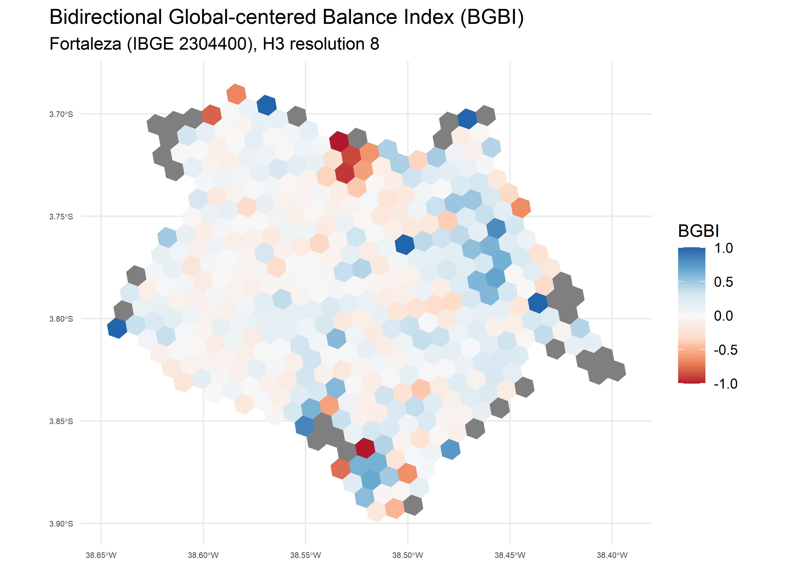
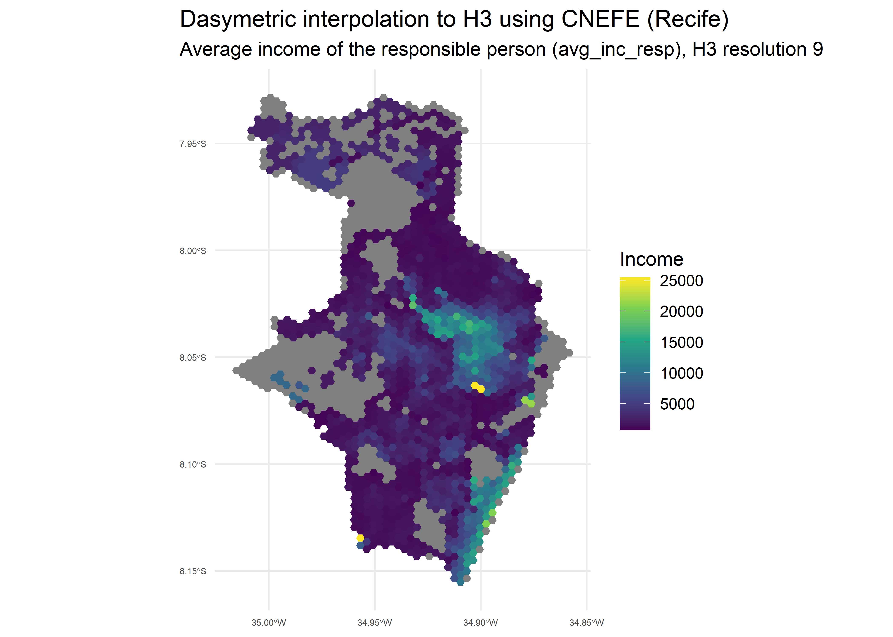
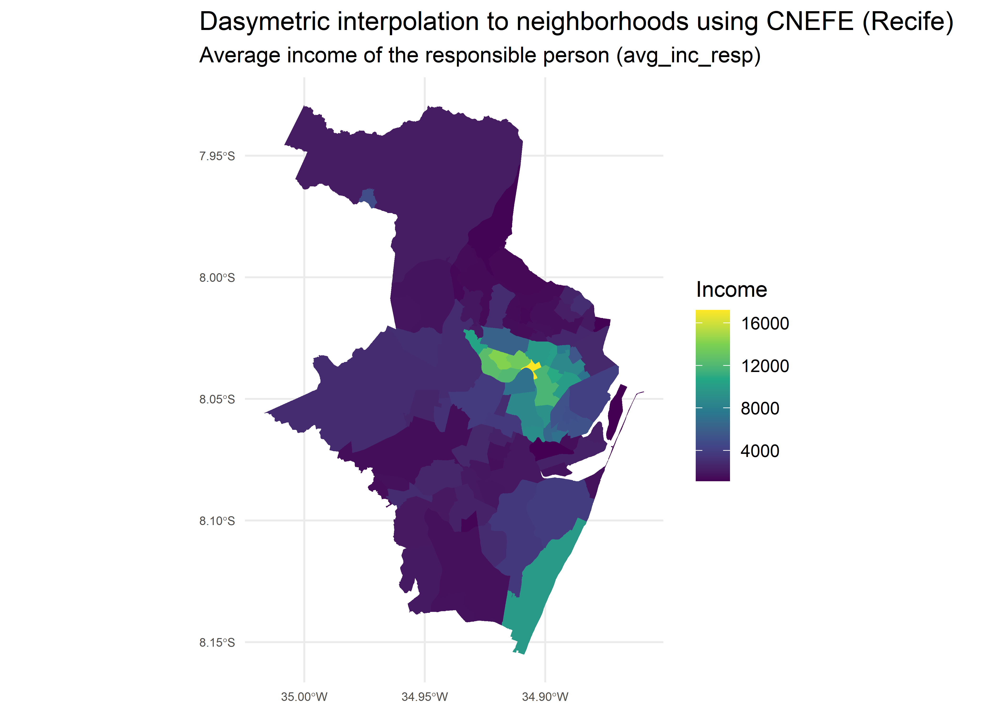

# cnefetools: Tools for working with Brazilian CNEFE address data <a href="https://pedreirajr.github.io/cnefetools/"></a>

[](https://github.com/pedreirajr/cnefetools/actions/workflows/R-CMD-check.yaml)
[](https://opensource.org/licenses/MIT)
[](https://lifecycle.r-lib.org/articles/stages.html#experimental)

**{cnefetools}** provides helper functions to efficiently work with the
Brazilian National Address File for Statistical Purposes (*Cadastro
Nacional de Endereços para Fins Estatísticos*, CNEFE), an address-level
dataset released by the Brazilian Institute of Geography and Statistics
(*Instituto Brasileiro de Geografia e Estatística*, IBGE).

## Installation

Install the stable version from CRAN:

``` r
install.packages("cnefetools")
```

To install the development version from GitHub:

``` r
# install.packages("pak")
pak::pak("pedreirajr/cnefetools")

# or
# install.packages("remotes")
remotes::install_github("pedreirajr/cnefetools")
```

## Overview

| Function | Description |
|----|----|
| `read_cnefe()` | Downloads and reads CNEFE data for a municipality; returns an Arrow table or `sf` object |
| `cnefe_counts()` | Aggregates address counts to H3 hexagons or user-provided polygons |
| `compute_lumi()` | Computes land-use mix indices on H3 hexagons or user-provided polygons |
| `tracts_to_h3()` | Dasymetric interpolation of census tract variables to an H3 grid via CNEFE dwelling points |
| `tracts_to_polygon()` | Dasymetric interpolation of census tract variables to user-provided polygons via CNEFE dwelling points |
| `cnefe_doc()` | Opens the official CNEFE methodological note (PDF) |
| `cnefe_dictionary()` | Opens the official CNEFE variable dictionary (Excel) |

## Reading CNEFE data

`read_cnefe()` downloads and reads the CNEFE CSV for a municipality,
returning an Arrow table by default:

``` r
library(cnefetools)
library(dplyr)

# Read CNEFE data for Salvador as an Arrow table
tab_ssa <- read_cnefe(2927408, cache = TRUE)

tab_ssa |>
  collect() |> # materialize the arrow table in R
  tibble() |>
  head()
#> # A tibble: 6 × 34
#>   COD_UNICO_ENDERECO COD_UF COD_MUNICIPIO COD_DISTRITO COD_SUBDISTRITO COD_SETOR
#>                <int>  <int>         <int>        <int>         <int64> <chr>    
#> 1          222386741     29       2927408    292740805     29274080518 29274080…
#> 2           27995350     29       2927408    292740805     29274080522 29274080…
#> 3           28034841     29       2927408    292740805     29274080522 29274080…
#> 4          217544957     29       2927408    292740805     29274080518 29274080…
#> 5          217639781     29       2927408    292740805     29274080526 29274080…
#> 6          217639701     29       2927408    292740805     29274080526 29274080…
#> # ℹ 28 more variables: NUM_QUADRA <int>, NUM_FACE <int>, CEP <int>,
#> #   DSC_LOCALIDADE <chr>, NOM_TIPO_SEGLOGR <chr>, NOM_TITULO_SEGLOGR <chr>,
#> #   NOM_SEGLOGR <chr>, NUM_ENDERECO <int>, DSC_MODIFICADOR <chr>,
#> #   NOM_COMP_ELEM1 <chr>, VAL_COMP_ELEM1 <chr>, NOM_COMP_ELEM2 <chr>,
#> #   VAL_COMP_ELEM2 <chr>, NOM_COMP_ELEM3 <chr>, VAL_COMP_ELEM3 <chr>,
#> #   NOM_COMP_ELEM4 <chr>, VAL_COMP_ELEM4 <chr>, NOM_COMP_ELEM5 <chr>,
#> #   VAL_COMP_ELEM5 <chr>, LATITUDE <dbl>, LONGITUDE <dbl>, …
```

Setting `output = "sf"` returns an `sf` object instead. The example
below reads data for Salvador, filters religious facilities
(`COD_ESPECIE == 8`), and plots them:

``` r
library(sf)
library(ggplot2)

# Reading CNEFE data
tab_ssa_sf <- read_cnefe(
  code_muni = 2927408, 
  output = "sf", 
  cache = TRUE
  )

# Filtering religious establishments
temples_ssa <- tab_ssa_sf |>
  filter(COD_ESPECIE == 8)

# Ploting religious establishments points for Salvador
ggplot() +
  geom_sf(data = temples_ssa, size = 0.3, alpha = 0.6) +
  coord_sf() +
  theme_minimal()
```



**Warning:** For large municipalities, CNEFE may contain more than 1
million address points. Plotting all coordinates at once can be slow and
memory-intensive, so consider filtering or sampling before creating
maps.

## Caching behavior

By default, `cache = TRUE` stores the downloaded ZIP file in a
user-level cache directory specific to this package. If you prefer to
avoid persistent caching, set:

``` r
tab_ssa <- read_cnefe(code_muni = 2927408, cache = FALSE)
```

In this case, the ZIP file is stored in a temporary location and removed
after reading.

## Accessing official CNEFE documentation

**{cnefetools}** includes local copies of the official methodological
note and the variable dictionary for the 2022 CNEFE released by IBGE.

``` r
# Open the official methodological note (PDF)
cnefe_doc(year = 2022)

# Open the official variable dictionary (.xls spreadsheet)
cnefe_dictionary(year = 2022)
```

## Counting addresses with `cnefe_counts()`

`cnefe_counts()` aggregates CNEFE address points into spatial units and
returns an `sf` object with counts by address category (`addr_type1` to
`addr_type8`). Below is an example using H3 hexagons for São Paulo at
resolution 9:

``` r
library(cnefetools)
library(sf)
library(ggplot2)

# Producing CNEFE counts
hex_sp <- cnefe_counts(
  code_muni = 3550308,
  h3_resolution = 9,
  verbose = TRUE
  )
```

Below we plot the count of private households (`addr_type1`) per
hexagon:

``` r
# Plotting private households (addr_type1) for São Paulo
ggplot(hex_sp) +
  geom_sf(aes(fill = addr_type1), color = NA) +
  scale_fill_viridis_c(option = "magma") +
  coord_sf() +
  labs(
    fill = "Count",
    title = "Private households (addr_type1)",
    subtitle = "São Paulo (IBGE 3550308), H3 resolution 9"
  ) +
  theme_minimal()+
  theme(
    plot.title.position = "plot",
    axis.text.x = element_text(size = 5),
    axis.text.y = element_text(size = 5)
  )
```


`cnefe_counts()` also supports `polygon_type = "user"` to aggregate
counts to custom polygons instead of H3 hexagons. See the [cnefe_counts
article](https://pedreirajr.github.io/cnefetools/articles/cnefe_counts.html)
for details.

## Land-use mix indices with `compute_lumi()`

`compute_lumi()` computes land-use mix indicators on spatial units for
any municipality covered by the 2022 CNEFE dataset ([Pedreira Junior et
al., 2025](https://engrxiv.org/preprint/view/5975/version/7846)).
Available indicators include the Entropy Index (`ei`), the
Herfindahl-Hirschman Index (`hhi`), the Balance Index (`bal`), the Index
of Concentration at Extremes (`ice`), an adapted HHI (`hhi_adp`), and
the Bidirectional Global-centered Balance Index (`bgbi`).

Below is an example for Fortaleza at H3 resolution 8:

``` r
library(cnefetools)
library(sf)
library(ggplot2)

# Computing land use mix indices
lumi_ftl <- compute_lumi(
  code_muni = 2304400,
  h3_resolution = 8,
  verbose = TRUE
  )
```

Below we plot the Bidirectional Global-centered Balance Index (BGBI),
where positive values indicate residential dominance and negative values
indicate non-residential dominance:

``` r
# Plotting the BGBI index
ggplot(lumi_ftl) +
  geom_sf(aes(fill = bgbi), color = NA) +
  scale_fill_distiller(
    type = "div",
    palette = "RdBu",
    direction = 1
  ) +
  coord_sf() +
  labs(
    fill = "BGBI",
    title = "Bidirectional Global-centered Balance Index (BGBI)",
    subtitle = "Fortaleza (IBGE 2304400), H3 resolution 8"
  ) +
  theme_minimal()+
  theme(
    plot.title.position = "plot",
    axis.text.x = element_text(size = 5),
    axis.text.y = element_text(size = 5)
  )
```



`compute_lumi()` also supports `polygon_type = "user"` to compute
indices on custom polygons. See the [compute_lumi
article](https://pedreirajr.github.io/cnefetools/articles/compute_lumi.html)
for details.

## Dasymetric interpolation with `tracts_to_h3()`

`tracts_to_h3()` performs a dasymetric interpolation, considering two
stages: first, census tract totals are allocated to individual CNEFE
dwelling points inside each tract; then, the allocated values are
aggregated to an H3 grid at the chosen resolution. This leverages the
fine-grained spatial distribution of addresses in CNEFE to produce more
realistic sub-tract estimates than simple areal weighting.

``` r
library(cnefetools)
library(ggplot2)

# Performing dasymetric interpolation
rec_hex <- tracts_to_h3(
  code_muni = 2611606,
  h3_resolution = 9,
  vars = c("pop_ph", "avg_inc_resp"),
  cache = TRUE,
  verbose = TRUE
)
```

The resulting H3 grid can be mapped to visualize the spatial
distribution of each variable. Below we plot the private-household
population (`pop_ph`):

``` r
ggplot(rec_hex) +
  geom_sf(aes(fill = pop_ph), color = NA) +
  scale_fill_viridis_c() +
  coord_sf() +
  labs(
    title = "Dasymetric interpolation to H3 using CNEFE (Recife)",
    subtitle = "Private-household population (pop_ph), H3 resolution 9",
    fill = "Population"
  ) +
  theme_minimal() +
  theme(
    plot.title.position = "plot",
    axis.text.x = element_text(size = 5),
    axis.text.y = element_text(size = 5)
  )
```


And the average income of the household head (`avg_inc_resp`):

``` r
ggplot(rec_hex) +
  geom_sf(aes(fill = avg_inc_resp), color = NA) +
  scale_fill_viridis_c() +
  coord_sf() +
  labs(
    title = "Dasymetric interpolation to H3 using CNEFE (Recife)",
    subtitle = "Average income of the responsible person (avg_inc_resp), H3 resolution 9",
    fill = "Income"
  ) +
  theme_minimal() +
  theme(
    plot.title.position = "plot",
    axis.text.x = element_text(size = 5),
    axis.text.y = element_text(size = 5)
  )
```



The full list of available variables is documented in the
`tracts_variables_ref` dataset (see `?tracts_variables_ref`). For
allocation rules and diagnostic details, see the [tracts_to
article](https://pedreirajr.github.io/cnefetools/articles/tracts_to.html).

## Dasymetric interpolation with `tracts_to_polygon()`

`tracts_to_polygon()` follows the same two-stage workflow as
`tracts_to_h3()`, but aggregates the allocated values to user-provided
polygons (e.g. neighborhoods, administrative divisions, or custom areas)
instead of an H3 grid. Let’s generate the neighborhoods of Recife with
the `read_neighborhood()` function from the `geobr` package and
interpolate the average income of household heads per neighborhood:

``` r
library(geobr)

# Reading neighborhoods from geobr package
rec_nei <- read_neighborhood(year = 2022, simplified = F, showProgress = F) |>
  filter(name_muni == 'Recife')

# Dasymetric interpolation to neighborhoods
rec_poly <- tracts_to_polygon(
  code_muni = 2611606,
  polygon = rec_nei,
  vars = c("pop_ph", "avg_inc_resp"),
  verbose = F
)
```

Below we plot the interpolated average income of the household head
(`avg_inc_resp`) at the neighborhood level:

``` r
# Plotting variables at the neighborhood level
ggplot(rec_poly) +
  geom_sf(aes(fill = avg_inc_resp), color = NA) +
  scale_fill_viridis_c() +
  coord_sf() +
  labs(
    title = "Dasymetric interpolation to neighborhoods using CNEFE (Recife)",
    subtitle = "Average income of the responsible person (avg_inc_resp)",
    fill = "Income"
  ) +
  theme_minimal() +
  theme(
    plot.title.position = "plot",
    axis.text.x = element_text(size = 5),
    axis.text.y = element_text(size = 5)
  )
```



See the [tracts_to
article](https://pedreirajr.github.io/cnefetools/articles/tracts_to.html)
for details.

## DuckDB-powered spatial operations

Under the hood, **{cnefetools}** uses [DuckDB](https://duckdb.org/) as
its default backend to perform spatial operations efficiently, with
speedups of 5–40x over pure-R code depending on the number of address
points and the size of the spatial units. This is made possible by three
DuckDB extensions:

- [**spatial**](https://duckdb.org/docs/stable/core_extensions/spatial/overview):
  performs spatial joins (e.g., point-in-polygon) in SQL, used when
  aggregating to user-provided polygons or performing dasymetric
  interpolation.
- [**zipfs**](https://duckdb.org/community_extensions/extensions/zipfs):
  reads CSV files directly from cached ZIP archives, avoiding the need
  to extract files to disk.
- [**h3**](https://duckdb.org/community_extensions/extensions/h3):
  assigns geographic coordinates to [H3 hexagonal
  grid](https://h3geo.org/) cells entirely inside DuckDB.

The R package [**duckspatial**](https://cidree.github.io/duckspatial/)
also bridges `sf` objects and DuckDB’s spatial extension, enabling
seamless transfers between R and DuckDB.

All extensions are installed and loaded automatically on first use. A
pure-R fallback (`backend = "r"`) is also available, using `h3jsr` and
`sf` for the same operations on `cnefe_counts()` and `compute_lumi()`
functions (slower, but without the DuckDB dependency).

## Citation

If you use **{cnefetools}** in your work, please cite the associated
preprint:

> Pedreira Jr., J. U.; Louro, T. V.; Assis, L. B. M.; Brito, P. L.
> *Measuring land use mix with address-level census data* (2025).
> engrXiv. <https://engrxiv.org/preprint/view/5975>
