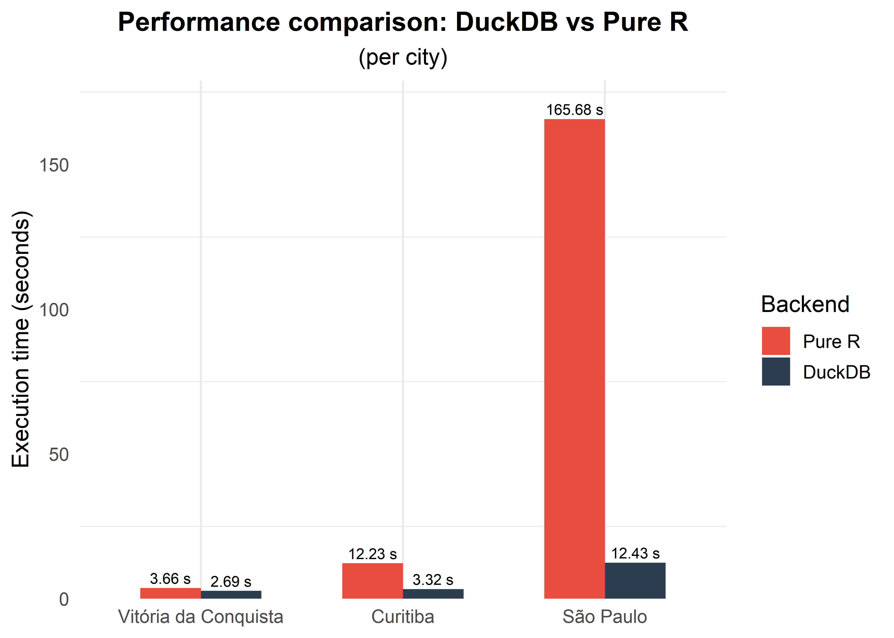
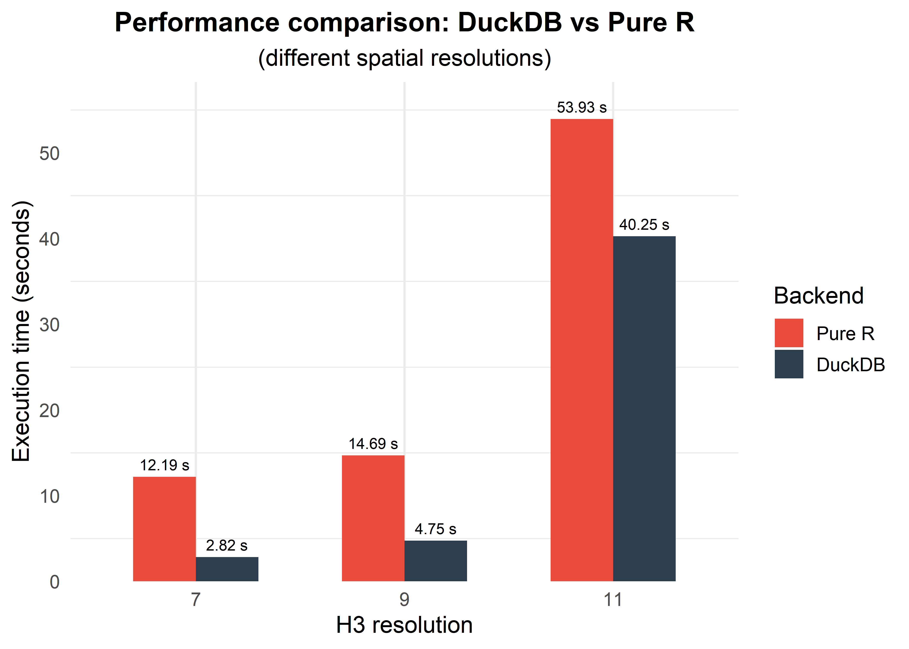

```{r setup, include=FALSE}
knitr::opts_chunk$set(
  echo = TRUE,
  collapse = TRUE,
  comment = "#>",
  message = FALSE,
  warning = FALSE,
  eval = FALSE
)

# Patch distill so that an explicit `last_name:` in the YAML author block
# takes precedence over the default behaviour of splitting `name` on spaces
# and using the last word (which would produce "Junior" instead of
# "Pedreira Junior").
local({
  patched <- function(authors) {
    lapply(authors, function(author) {
      if (is.null(author$name)) {
        fn <- if (!is.null(author$first_name)) author$first_name else ""
        ln <- if (!is.null(author$last_name))  author$last_name  else ""
        author$name <- trimws(paste(fn, ln))
      } else {
        names <- strsplit(author$name, "\\s+")[[1]]
        author$first_name <- paste(utils::head(names, -1), collapse = " ")
        if (is.null(author$last_name))
          author$last_name <- utils::tail(names, 1)
      }
      author
    })
  }
  utils::assignInNamespace("authors_with_first_and_last_names", patched, "distill")
})

# Helper: format inline code in captions for both PDF (LaTeX) and HTML.
cfmt <- function(x) {
  if (knitr::is_latex_output()) {
    x_esc <- gsub("_", "\\_", x, fixed = TRUE)
    x_esc <- gsub("$", "\\$", x_esc, fixed = TRUE)
    sprintf("\\texttt{%s}", x_esc)
  } else {
    sprintf("`%s`", x)
  }
}
```

# Introduction

Address-level data are a fundamental resource for urban and regional
analysis. They enable fine-grained characterisation of land use,
population distribution, and the spatial organisation of economic and
social activities. Unlike parcel boundaries or building footprints,
which often require proprietary sources, geocoded address registers are
administrative by-products of census enumeration, making them publicly
available in several countries.

Brazil is home to the fifth-largest population in the world, with
approximately 213 million inhabitants spread across 5,570 municipalities
[@ibge2026]. The 2022 Brazilian Census, conducted by the *Instituto
Brasileiro de Geografia e Estatística* (IBGE), produced a rich
by-product: the *Cadastro Nacional de Endereços para Fins Estatísticos*
(CNEFE, National Address File for Statistical Purposes). This dataset
records the geocoordinates and functional category of approximately 110
million addresses across the entire country.

Despite its potential, the CNEFE presents significant barriers to use.
The data are distributed as individual ZIP-compressed CSV files (one per
municipality or state) via the IBGE FTP server. Municipal files can
reach 177 MB compressed (901 MB uncompressed), as in the case of São
Paulo, which contains more than 5.6 million point addresses. Spatial
operations on these files (assigning points to grid cells, computing
land use mix, or matching them to census tract polygons) require
substantial data engineering. As a result, researchers who could benefit
from this dataset are often unable to leverage it without considerable
ad-hoc effort.

The \CRANpkg{cnefetools} package addresses this gap. It provides a
unified interface for downloading, caching, and analysing CNEFE data
directly from R, with four principal capabilities:

1.  **Data access**: download and read CNEFE data for any municipality,
    with transparent caching to avoid repeated downloads.
2.  **Address counts**: aggregate address points to H3 hexagonal grids
    or user-supplied polygons, returning counts by address type.
3.  **Land use mix indices**: compute a suite of six established and
    novel land use mix (LUM) indices.
4.  **Dasymetric interpolation**: redistribute census tract aggregates
    to any spatial unit using CNEFE dwelling points as ancillary data.

For the interpolation task, a few packages exist for this purpose, but
with limitations worth noting. Areal-weighted approaches, such as those
provided by \CRANpkg{sf} [@pebesma2018] and \CRANpkg{areal}
[@prener2019], assume a uniform distribution of the attribute within
each source zone, which is methodologically weaker than dasymetric
methods that incorporate ancillary data on where people actually live.
\CRANpkg{populR} [@batsaris2023] takes a dasymetric approach using
building footprints from OpenStreetMap as ancillary data, but footprints
capture ground-floor area rather than dwelling counts: a high-rise
residential tower and a single-storey house may have similar footprints
yet house very different numbers of households. Because each CNEFE
record corresponds to one address unit, the point count within a zone
directly reflects the number of dwellings, making it a more precise
ancillary variable for identifying population density in verticalized
urban environments. Beyond interpolation, no R package currently
provides tools for computing land use mix indices from either
address-level or polygon-based data.

A key technical contribution is a dual-backend architecture. The default
DuckDB backend [@duckdb2019], supported by the \pkg{duckdb} R package,
reads CSV data directly from cached ZIP archives without prior
extraction, performs H3 cell assignment and spatial joins entirely
in-process, and returns only the final aggregated result to R. This
design achieves speedups of up to 13$\times$ over a pure-R fallback
based on \CRANpkg{h3jsr} [@h3jsr2023] and \CRANpkg{sf} [@pebesma2018]
(see Section 5 for benchmarks).

This paper is organised as follows. Section 2 describes the CNEFE
dataset and its distribution. Section 3 presents the architectural
decisions underpinning \pkg{cnefetools}. Section 4 describes each
exported function in detail. Section 5 reports performance benchmarks.
Section 6 summarises contributions and discusses future directions.

# The CNEFE dataset

The Cadastro Nacional de Endereços para Fins Estatísticos (CNEFE) is the
geocoded address register produced alongside the 2022 Brazilian Census.
First established in 2005 and updated after every demographic census, it
was designed to serve statistical (rather than postal) purposes, and as
such it records not only residences but also non-residential address
points including commercial establishments, agricultural units, schools,
health facilities, and religious institutions [@ibge_cnefe2024].
Although a CNEFE was produced alongside the 2010 census, the precision
achieved at that time was limited to the block-face level
[@ibge_cnefe2024]. \pkg{cnefetools} therefore targets the 2022 edition
and future censuses, as 2022 is the first to provide address-level
geocoordinates for the full national register.

During the 2022 census, coordinates were collected by enumerators
equipped with mobile devices integrating GNSS receivers. Each device was
preloaded with a list of addresses for the assigned census tract and up
to three GNSS readings were required before the enumerator could
classify an address by functional type. After field collection, IBGE
applied an extensive post-processing workflow: invalid or missing
coordinates were estimated from block-face geometry, confirmed nearby
addresses, or the enumerator's recorded position at the time of
interview. Quality levels were classified by geocoding resolution:
address, block face, locality, or census tract. Pre-census testing
measured mean squared error (MSE) of 5.84 m, with maximum error below
11.71 m under ideal open-sky conditions and typical collection
environments [@ibge_cnefe2024].

## Structure, scale and distribution

Each CNEFE record corresponds to a single address point. The dataset
uses a fixed schema of 34 columns. The most analytically relevant
columns are:

-   **`LONGITUDE`** and **`LATITUDE`**: geographic coordinates in the
    SIRGAS 2000 datum (EPSG:4674, approximately equivalent to WGS 84 for
    most applications).
-   **`COD_ESPECIE`**: an integer code (1--8) identifying the functional
    category of the address, referred to in this paper as the *address
    type*. The eight categories are listed in Table
    \@ref(tab:tab-especie).
-   Address description fields, including street type
    (**`NOM_TIPO_SEGLOGR`**), street name (**`NOM_SEGLOGR`**), address
    number (**`NUM_ENDERECO`**), free-text address description
    (**`DSC_ESTABELECIMENTO`**), and postal code (**`CEP`**).

| Code |       English label        |           Portuguese label            |
|:----:|:--------------------------:|:-------------------------------------:|
|  1   |     Private household      |         Domicílio particular          |
|  2   |    Collective household    |          Domicílio coletivo           |
|  3   | Agricultural establishment |     Estabelecimento agropecuário      |
|  4   | Educational establishment  |       Estabelecimento de ensino       |
|  5   |    Health establishment    |       Estabelecimento de saúde        |
|  6   |    Other establishment     | Estabelecimento de outras finalidades |
|  7   |     Under construction     |  Edificação em construção ou reforma  |
|  8   |  Religious establishment   |       Estabelecimento religioso       |

: (#tab:tab-especie) CNEFE address types (`COD_ESPECIE`).

The CNEFE covers all Brazilian municipalities. The number of address
records per municipality ranges from a few hundred in small rural
municipalities to more than 5.6 million in the city of São Paulo, the
most populous city in the Southern Hemisphere. The consolidated dataset
comprises 111.1 million geographic records, of which 98.95% were
validated as spatially coherent. More than 110.7 million records
(99.68%) were geocoded at the address level: 93.8% from original field
coordinates, 5.5% with standardised corrections (e.g., apartment units
sharing the same street number), and 0.7% estimated via spatial
interpolation.

Within the universe of constructed addresses, private dwellings (address
type 1) are the most numerous, comprising approximately 90.6 million
records (81.5% of the total). Collective households (address type 2)
account for roughly 104,500 records (0.1%). Among non-residential types,
other-purpose establishments (address type 6) number approximately 11.7
million (10.5%), followed by agricultural establishments (address type
3) at 4.1 million (3.7%), while educational (address type 4), health
(address type 5), and religious establishments (address type 8) jointly
account for approximately 1.1 million records (1.0%). Buildings under
construction (address type 7) numbered approximately 3.5 million (3.2%).

The data are distributed by IBGE via an FTP server at
<https://ftp.ibge.gov.br/Cadastro_Nacional_de_Enderecos_para_Fins_Estatisticos/>.
Files are organised hierarchically by Federative Unit/state (UF) and
municipality. Each municipality's data are stored as a
semicolon-delimited CSV file compressed inside a ZIP archive.

## Challenges for programmatic use

Working with the CNEFE presents several practical difficulties that
\pkg{cnefetools} is designed to overcome:

-   **Discovery**: there is no unified index of download URLs.
    Constructing the correct URL requires knowledge of the state
    acronym, the full municipality name as it appears in the FTP
    directory (which does not always match standard IBGE name fields),
    and the municipality code.

-   **Download size**: while most files are modest, the largest cities
    produce ZIP files running into the hundreds of megabytes.

-   **Spatial operations at scale**: assigning millions of point
    coordinates to hexagonal cells or performing point-in-polygon joins
    with census tract geometries is computationally intensive in pure R.

# Package design

\pkg{cnefetools} addresses the challenges above through three key design
decisions: a pre-built URL index, a persistent user-level cache, and a
dual DuckDB/R backend.

## Pre-built municipality index

The package ships with an internal data frame (`cnefe_index`) that maps
each of Brazil's 5,570 seven-digit IBGE municipality codes to its
corresponding CNEFE ZIP download URL. This index was constructed from
the FTP directory listing at the time of package release. The index also
records the municipality name and the UF, enabling
informative error messages when an unrecognised code is provided.
Municipality codes are validated and normalised by an internal helper,
which accepts integer, character, and numeric inputs and checks that the
code is a seven-digit IBGE code present in the index.

## Persistent user-level caching

ZIP files are cached in the user's application data directory, obtained
via `tools::R_user_dir("cnefetools", "cache")`. Caching is available
across all functions that access CNEFE data — `read_cnefe()`,
`cnefe_counts()`, `compute_lumi()`, `tracts_to_h3()`, and
`tracts_to_polygon()` — so that once a municipality's ZIP file has been
downloaded, subsequent calls reuse the cached file without
re-downloading. The cache directory is created on first use and persists
across R sessions.

Download integrity is verified by checking that the downloaded file is a
valid ZIP archive and that it contains a CSV file matching the expected
naming pattern. Corrupted or incomplete downloads are detected and
retried with increasing timeout thresholds (300 s, 600 s, and 1,800 s).
Caching can be disabled with `cache = FALSE`, in which case the ZIP is
written to a temporary file and removed when the function exits. Users
also have direct control over the local cache: `clear_cache_muni()` and
`clear_cache_tracts()` allow selectively removing cached files, either
all at once or filtered by municipality or state (see Section
\@ref(utility-functions)).

## Dual-backend architecture

For the computationally intensive operations in `cnefe_counts()` and
`compute_lumi()`, such as assigning millions of coordinates to H3
hexagons or user-supplied polygons and performing spatial joins, users
can choose between two backends via the `backend` argument:

-   **`"duckdb"` (default)**: uses the \CRANpkg{duckdb} [@duckdb_r2024]
    R package to spin up an in-memory DuckDB database. The `zipfs`
    extension is always loaded to read CSV data directly from the cached
    ZIP without decompression. For H3 aggregation, the `h3` extension
    assigns cell indices entirely in SQL, while for user-provided
    polygons, the `spatial` extension and the \CRANpkg{duckspatial} R
    package handle the point-in-polygon join. Only the final aggregated
    result is transferred to R.

-   **`"r"`**: for H3 aggregation, \CRANpkg{h3jsr} assigns each point to
    a cell, whereas for user-provided polygons, \CRANpkg{sf} performs
    the point-in-polygon join. This backend is slower but requires no
    DuckDB dependency whatsoever.

The dasymetric interpolation functions `tracts_to_h3()` and
`tracts_to_polygon()` do not expose this argument and rely on DuckDB
exclusively. Additionally, census tract geometry assets required by
`tracts_to_h3()` and `tracts_to_polygon()` are stored as Parquet files
(one per UF, each containing a `geom_wkb` column with census tract
polygons encoded in Well-Known Binary) and published as assets on the
package's GitHub Releases page. They are downloaded on-demand with
caching via the \CRANpkg{piggyback} package.

## Input validation

All user-facing functions validate their inputs using
\CRANpkg{checkmate} [@lang2017] before any I/O or computation.
Municipality codes are normalised and checked against the built-in
index. Polygon inputs are verified to be `sf` objects with `POLYGON` or
`MULTIPOLYGON` geometry types, and invalid geometries are repaired with
`sf::st_make_valid()`. CRS arguments are validated by attempting
`sf::st_crs()` on the user-supplied value.

# Core functionality

\pkg{cnefetools} exposes four independent analytical functions, each
targeting a distinct use case: `read_cnefe()` exposes the raw CNEFE
data, `cnefe_counts()` aggregates address points to H3 hexagonal grids
or user-supplied polygons, `compute_lumi()` computes land use mix
indices over the same spatial units, and `tracts_to_h3()` or
`tracts_to_polygon()` performs dasymetric interpolation of census tract
variables. Because every analytical function handles downloading and
caching internally, users call whichever function fits their need
directly — no separate data-loading step is required.

## Reading CNEFE data: `read_cnefe()`

`read_cnefe()` is the entry point to the package. It downloads (if not
cached) and reads the CNEFE CSV for a municipality, returning either an
\CRANpkg{arrow} `Table` or an \CRANpkg{sf} point object. The code below
shows how to download CNEFE data for the municipality of Lauro de
Freitas (IBGE code 2919207).

```{r read-cnefe-example}
library(cnefetools)

# Read as an Arrow table (default; no spatial conversion)
cnefe <- read_cnefe(
  code_muni = 2919207,
  year      = 2022,
  cache     = TRUE,
  verbose   = TRUE,
  output    = 'arrow'    # default
)

# Read as an sf point object with SIRGAS 2000 coordinates (EPSG:4674)
cnefe_sf <- read_cnefe(
  code_muni = 2919207,
  year      = 2022,
  cache     = TRUE,
  verbose   = TRUE,
  output    = 'sf'
) 
```

The `output = "arrow"` default (an `arrow::Table`) is preferred for
large municipalities because it avoids materialising the full data frame
in memory. The table can be filtered and projected using \CRANpkg{dplyr}
verbs applied to Arrow tables before conversion to a data frame. The
`output = "sf"` option converts the Arrow table to a data frame, coerces
`LONGITUDE` and `LATITUDE` to numeric, drops rows with missing
coordinates, and constructs an `sf` point object in CRS 4674 (SIRGAS
2000).

The code below previews five selected columns for the first six records
of the dataset previously read as an \CRANpkg{sf} point object.

```{r cnefe-preview, echo=-1, eval=TRUE, cache=TRUE}
cnefe_sf <- cnefetools::read_cnefe(
  code_muni = 2919207, output = "sf", verbose = FALSE
)
cnefe_sf |>
  sf::st_drop_geometry() |>
  dplyr::select(NOM_TIPO_SEGLOGR, NOM_SEGLOGR, CEP, COD_ESPECIE,
                LONGITUDE, LATITUDE, DSC_ESTABELECIMENTO) |>
  head()
```

The function accepts the `year` argument (currently only 2022 is
supported), `cache` to control ZIP caching, and `verbose` to toggle
informative progress messages. Figure \@ref(fig:fig-read-cnefe) maps the
private household addresses for Lauro de Freitas which was previously
read in `cnefe_sf`.

```{r fig-read-cnefe, echo=FALSE, eval=TRUE, cache=TRUE, fig.cap="Private household addresses geocoded in Lauro de Freitas, Bahia.", fig.alt="Map of Lauro de Freitas municipality showing private household address points as blue dots distributed across the urban area, with the municipal boundary outlined in black on a light grey background.", fig.width=6, fig.height=5, out.width="100%"}
library(geobr)
library(ggplot2)
library(sf)
library(dplyr)

# Lauro de Freitas boundary
muni_ldf <- geobr::read_municipality(code_muni = 2919207, 
                                     year = 2020,
                                     simplified = FALSE,
                                     showProgress = FALSE)

# CNEFE private households only (COD_ESPECIE == 1)
private <- cnefetools::read_cnefe(
  code_muni = 2919207, output = "sf", verbose = FALSE
) |>
  dplyr::filter(COD_ESPECIE == 1)

ggplot() +
  geom_sf(data = muni_ldf, fill = "grey95", color = "black", linewidth = 0.7) +
  geom_sf(data = private, size = 0.05, alpha = 0.2, color = "#2166AC") +
  theme_void() +
  theme(plot.background = element_rect(fill = "white", color = NA))
```

## Address counts on spatial units: `cnefe_counts()`

`cnefe_counts()` aggregates CNEFE address points to areal spatial units
and returns counts of each address type (1 through 8) as columns
`addr_type1` to `addr_type8`. To illustrate both output modes, the
examples below count addresses per H3 hexagon at resolution 9 and per
official neighborhood boundary obtained from \CRANpkg{geobr}
[@geobr2019].

```{r counts-hex-example}
# Count addresses per H3 hexagon at resolution 9
hex_counts <- cnefe_counts(
  code_muni     = 2919207,
  year          = 2022,
  cache         = TRUE,
  polygon_type  = "hex",
  h3_resolution = 9,
  verbose       = TRUE,
  backend       = "duckdb"
)

# Count per user-supplied polygon (e.g., neighborhoods)
library(geobr)
library(dplyr)
nei <- read_neighborhood(year = 2022) |> 
  filter(code_muni == 2919207)

poly_counts <- cnefe_counts(
  code_muni    = 2919207,
  year         = 2022,
  cache        = TRUE,
  polygon_type = "user",
  polygon      = nei,
  crs_output   = NULL,
  verbose      = TRUE,
  backend      = "duckdb"
)
```

When `polygon_type = "hex"` (default), the function builds a complete H3
grid over the municipality boundary using \CRANpkg{geobr} to obtain the
boundary polygon and \CRANpkg{h3jsr} to generate the hexagon geometries.
The DuckDB `h3` extension is used (when `backend = "duckdb"`) to assign
CNEFE points to cells in SQL, but the grid itself is always constructed
via \CRANpkg{h3jsr}. The H3 resolution can be set from 0 (coarse) to 15
(fine), and the default is 9, corresponding to an average hexagon area
of approximately 105,000 m².

When `polygon_type = "user"`, the function performs a point-in-polygon
join between the CNEFE coordinates and the user-supplied `sf` polygon. A
warning is issued if any CNEFE points fall outside the polygon, together
with the coverage percentage, and an error is raised if no points fall
inside.

The output `sf` object inherits the polygon geometry: H3 hexagons when
`polygon_type = "hex"`, or the user-supplied polygons (in their original
CRS, or `crs_output` if specified) when `polygon_type = "user"`. Figure
\@ref(fig:fig-counts) illustrates both modes for Lauro de Freitas at H3
resolution 8 and at the neighborhood level.

```{r fig-counts, echo=FALSE, eval=TRUE, cache=TRUE, fig.cap=paste0("Private household address counts (", cfmt("addr_type1"), ") aggregated to H3 hexagons at resolution~8 (left) and to neighborhoods (right) for Lauro de Freitas, Bahia."), fig.alt="Two side-by-side choropleth maps of Lauro de Freitas. The left map shows private household address counts aggregated to H3 hexagons at resolution 8; the right map shows the same counts aggregated to neighborhoods. Both maps use a green-to-yellow colour scale where darker green indicates lower counts and bright yellow indicates higher counts.", fig.width=10, fig.height=5, out.width="100%"}
library(geobr)
library(ggplot2)
library(sf)
library(dplyr)
library(patchwork)
library(paletteer)

# Lauro de Freitas boundary
muni_ldf <- geobr::read_municipality(code_muni = 2919207, year = 2020,
                                     showProgress = FALSE)

# Neighborhoods of Lauro de Freitas
nei <- geobr::read_neighborhood(year = 2022, showProgress = FALSE) |>
  dplyr::filter(name_muni == "Lauro de Freitas")

# Address counts per H3 hexagon at resolution 8
hex8 <- cnefetools::cnefe_counts(
  code_muni     = 2919207,
  h3_resolution = 8,
  verbose       = FALSE
)

# Address counts per neighborhood
poly_counts <- cnefetools::cnefe_counts(
  code_muni    = 2919207,
  polygon_type = "user",
  polygon      = nei,
  verbose      = FALSE
)

p1 <- ggplot(hex8) +
  geom_sf(aes(fill = addr_type1), color = NA)+
  paletteer::scale_fill_paletteer_c("grDevices::ag_GrnYl",
                                    direction = 1, 
                                    name = "Count")+
  labs(title = "H3 resolution 8") +
  theme_void() +
  theme(plot.title = element_text(hjust = 0.5, size = 11),
        legend.position = "right",
        plot.background = element_rect(fill = "white", color = NA))

p2 <- ggplot() +
  geom_sf(data = poly_counts, aes(fill = addr_type1), color = "white",
          linewidth = 0.2) +
  paletteer::scale_fill_paletteer_c("grDevices::ag_GrnYl",
                                    direction = 1, 
                                    name = "Count")+
  labs(title = "Neighborhoods") +
  theme_void() +
  theme(plot.title = element_text(hjust = 0.5, size = 11),
        legend.position = "right",
        plot.background = element_rect(fill = "white", color = NA))

p1 + p2
```

## Land use mix indices: `compute_lumi()`

`compute_lumi()` computes a suite of six land use mix (LUM) indices from
CNEFE address data. All indices are based on the local residential share
$p_i = n_{\text{res},i} / n_{\text{tot},i}$, where $n_{\text{res},i}$ is
the count of type-1 addresses (private households) and
$n_{\text{tot},i}$ is the total count of addresses of types 1--8,
excluding type 7 (under construction) due to its transitional nature.
The citywide residential share $P$ is computed from the full
municipality CNEFE.

Table \@ref(tab:lumi-table) summarises the seven indices computed by
`compute_lumi()`. Further methodological details on these indices can be
found in @song2013, @booth2001 and @pedreirajr2025.

| Index | Code | Formula | Range |
|:---------------:|:---------------:|:-------------------:|:---------------:|
| Residential share | `p_res` | $p_i$ | $[0,1]$ |
| Entropy Index | `ei` | $-\,(p_i \ln p_i + q_i \ln q_i)\,/\ln 2$ | $[0,1]$ |
| Herfindahl-Hirschman Index | `hhi` | $p_i^2 + q_i^2$ | $[0.5,\,1]$ |
| Balance Index | `bal` | $1 - \lvert p_i - r\,q_i\rvert\,/\,(p_i + r\,q_i)$ | $[0,1]$ |
| Index of Concentration at Extremes | `ice` | $p_i - q_i$ | $[-1,+1]$ |
| Adapted HHI | `hhi_adp` | $\mathrm{sign}(p_i - q_i)\cdot(\mathrm{HHI}_i - 0.5)\,/\,0.5$ | $[-1,+1]$ |
| BGBI | `bgbi` | $[(2p_i-1)-(2P-1)]\,/\,[1-(2p_i-1)(2P-1)]$ | $[-1,+1]$ |

: (#tab:lumi-table) Land use mix indices returned by `compute_lumi()`.
Here $q_i = 1 - p_i$ and $r = P/(1-P)$.

The parameter interface of `compute_lumi()` mirrors that of
`cnefe_counts()`:

```{r lumi-example}
# Compute all indices on H3 hexagons at resolution 9 (default)
lumi_hex <- compute_lumi(
  code_muni     = 2919207,
  year          = 2022,
  cache         = TRUE,
  polygon_type  = "hex",
  h3_resolution = 9,
  verbose       = TRUE,
  backend       = "duckdb"
)

# Compute on user-supplied polygons
lumi_poly <- compute_lumi(
  code_muni    = 2919207,
  year         = 2022,
  cache        = TRUE,
  polygon_type = "user",
  polygon      = nei,
  crs_output   = NULL,
  verbose      = TRUE,
  backend      = "duckdb"
)
```

The output `sf` object contains columns `id_hex` (or the original
polygon columns), `p_res`, `ei`, `hhi`, `bal`, `ice`, `hhi_adp`, `bgbi`,
and the polygon geometry. Figure \@ref(fig:fig-bgbi) maps the BGBI index
[@pedreirajr2025] for Lauro de Freitas at H3 resolution 8 and at the
neighborhood level.

```{r fig-bgbi, echo=FALSE, eval=TRUE, cache=TRUE, fig.cap="Bidirectional Global-centered Balance Index (BGBI) for Lauro de Freitas, Bahia, aggregated to H3 hexagons at resolution~8 (left) and to neighborhoods (right). Green cells indicate a local residential share above the citywide average ($p_i > P$); pink cells indicate non-residential dominance ($p_i < P$); white cells are near the citywide baseline.", fig.alt="Two side-by-side choropleth maps of Lauro de Freitas showing the BGBI index. The left map aggregates to H3 hexagons at resolution 8 and the right map aggregates to neighborhoods. Green areas indicate a local residential share above the citywide average, pink areas indicate non-residential dominance, and white or neutral areas are near the citywide baseline.", fig.width=10, fig.height=5, out.width="100%"}
library(geobr)
library(ggplot2)
library(sf)
library(dplyr)
library(patchwork)

# Lauro de Freitas boundary
muni_ldf <- geobr::read_municipality(code_muni = 2919207, year = 2020,
                                     showProgress = FALSE)

# Neighborhoods of Lauro de Freitas
nei <- geobr::read_neighborhood(year = 2022, showProgress = FALSE) |>
  dplyr::filter(name_muni == "Lauro de Freitas")

# BGBI per H3 hexagon at resolution 8
lumi_hex <- cnefetools::compute_lumi(
  code_muni     = 2919207,
  h3_resolution = 8,
  verbose       = FALSE
)

# BGBI per neighborhood
lumi_poly <- cnefetools::compute_lumi(
  code_muni    = 2919207,
  polygon_type = "user",
  polygon      = nei,
  verbose      = FALSE
)

tropic_colors <- paletteer::paletteer_c("grDevices::Tropic", n = 256, direction = -1)

p1 <- ggplot(lumi_hex) +
  geom_sf(aes(fill = bgbi), color = NA, linetype = 1) +
  geom_sf(data = dplyr::filter(lumi_hex, is.na(bgbi)),
          aes(linetype = "No data (NA)"),
          fill = NA, color = NA) +
  scale_fill_gradientn(
    colours  = tropic_colors,
    limits   = c(-1, 1),
    na.value = "gray40",
    name     = "BGBI"
  ) +
  scale_linetype_manual(
    values = 0, name = NULL,
    guide  = guide_legend(
      override.aes = list(fill = "grey40", color = NA, linewidth = 0)
    )
  ) +
  labs(title = "H3 resolution 8") +
  theme_void() +
  theme(plot.title = element_text(hjust = 0.5, size = 11),
        legend.position = "right",
        legend.box = "vertical",
        plot.background = element_rect(fill = "white", color = NA))

p2 <- ggplot() +
  geom_sf(data = lumi_poly, aes(fill = bgbi),
          color = "white", linewidth = 0.2, linetype = 1) +
  geom_sf(data = dplyr::filter(lumi_poly, is.na(bgbi)),
          aes(linetype = "No data (NA)"),
          fill = NA, color = NA) +
  scale_fill_gradientn(
    colours  = tropic_colors,
    limits   = c(-1, 1),
    na.value = "grey80",
    name     = "BGBI"
  ) +
  scale_linetype_manual(
    values = 0, name = NULL,
    guide  = guide_legend(
      override.aes = list(fill = "grey80", color = "white", linewidth = 0.2)
    )
  ) +
  labs(title = "Neighborhoods") +
  theme_void() +
  theme(plot.title = element_text(hjust = 0.5, size = 11),
        legend.position = "right",
        legend.box = "vertical",
        plot.background = element_rect(fill = "white", color = NA))

p1 + p2
```

Figure \@ref(fig:fig-bgbi) illustrates how the spatial pattern of the
BGBI can differ markedly between the H3 hexagonal grid and neighborhood
boundaries: some neighborhoods aggregate areas of contrasting land use,
smoothing out local variation that remains visible at the hexagon level,
while the coarser polygon boundaries may shift which zones appear
residentially dominant or non-residential. By allowing the same indices
to be computed across multiple H3 resolutions and over user-supplied
polygon layers, \pkg{cnefetools} makes it straightforward to assess the
sensitivity of land use mix measurement to spatial aggregation and,
therefore, to explicitly probe scale effects associated with the
Modifiable Areal Unit Problem (MAUP) [@dark2007].

## Dasymetric interpolation: `tracts_to_h3()` and `tracts_to_polygon()`

The 2022 Brazilian Census disseminates questionnaire results through
multiple geographic products, one of which is the *Agregados por Setores
Censitários* (aggregates by census tract). A census tract (*setor
censitário*) is the basic territorial unit of census collection and of
this particular dissemination product. For many applications, however,
the desired spatial unit differs from census tracts: researchers may
want data on a regular H3 grid for comparative analyses, or on custom
polygons such as traffic zones for transportation modelling or health
districts for public health management.

`tracts_to_h3()` and `tracts_to_polygon()` perform dasymetric
interpolation [@mennis2003] from census tract aggregates to user-defined
spatial units, using CNEFE dwelling points as ancillary data. Several R
packages address related polygon-to-polygon interpolation problems.
`sf::st_interpolate_aw()` [@pebesma2018] and \CRANpkg{areal}
[@prener2019], whose main function is `aw_interpolate()`, both implement
areal-weighted interpolation, distributing source-zone totals in
proportion to the overlap area between source and target polygons and
implicitly assuming a uniform spatial distribution of the attribute
within each source zone. \CRANpkg{smile} takes a model-based approach,
fitting an underlying continuous spatial process to areal data via
`fit_spm()` and predicting over target regions with `predict_spm()`,
propagating estimation uncertainty through the interpolation.

\CRANpkg{populR} [@batsaris2023] is the closest in spirit to
\pkg{cnefetools}: its `pp_estimate()` function supports both areal
weighting and a dasymetric mode that uses building footprints downloaded
from OpenStreetMap via `pp_vgi()` as ancillary data, weighting the
redistribution by the total floor area within each target zone rather
than by plain overlap area. `pp_compare()` additionally facilitates
accuracy assessment against reference counts.

\pkg{cnefetools} follows the same dasymetric logic as the
volume-weighting mode of \CRANpkg{populR}, but uses geocoded dwelling
points from the CNEFE register instead of building footprints. This
distinction matters in verticalized urban environments, as building
footprints capture ground-floor area but carry no information about how
many dwelling units a building contains. A high-rise residential tower
and an adjacent single-storey house may have similar footprints yet
house very different numbers of households. Because each CNEFE record
corresponds to one address unit, the point count within a zone directly
reflects the number of dwellings rather than the built area, which is a
more appropriate ancillary variable for redistributing population and
household-level census aggregates. The set of supported variables is
documented in Table \@ref(tab:tab-tracts-vars), which lists each
variable alongside its IBGE census tract code and source table.

```{r tab-tracts-vars, eval=TRUE, echo=FALSE}
library(cnefetools)
knitr::kable(
  tracts_variables_ref[, c("var_cnefetools", "code_var_ibge", "table_ibge")],
  col.names = c("Variable", "IBGE code", "IBGE table"),
  caption = if (knitr::is_latex_output()) {
    paste0(
      "Variables supported by \\texttt{tracts\\_to\\_h3()} and",
      " \\texttt{tracts\\_to\\_polygon()}, with their corresponding IBGE",
     " census tract variable codes and source tables. Portuguese descriptions",
      " are available in \\texttt{tracts\\_variables\\_ref\\$desc\\_var\\_ibge}."
    )
  } else {
    paste0(
      "Variables supported by `tracts_to_h3()` and",
      " `tracts_to_polygon()`, with their corresponding IBGE",
      " census tract variable codes and source tables. Portuguese descriptions",
      " are available in `tracts_variables_ref$desc_var_ibge`."
    )
  },
  booktabs = TRUE
)
```

The entire computation pipeline runs within an in-memory DuckDB instance
and proceeds in six steps, with all heavy operations remaining inside
DuckDB until the final aggregated result is materialised in R:

1.  **DuckDB setup**: an in-memory DuckDB database is opened and three
    extensions are loaded: `zipfs` (to read compressed CSV directly from
    the cached ZIP without extraction), `h3` (for H3 cell assignment in
    SQL), and `spatial` (for `ST_Within` point-in-polygon joins).

2.  **Census tract geometry**: the UF-level Parquet asset is registered
    as a DuckDB `VIEW` and immediately materialised into a persistent
    in-memory `TABLE`. A spatial R-tree index (`USING RTREE`) is built
    on the tract geometry column to accelerate the subsequent
    point-in-polygon join.

3.  **CNEFE points**: the municipality ZIP is mounted as a virtual file
    system via the `zipfs` extension, and DuckDB streams the
    semicolon-delimited CSV directly without extracting it to disk. Only
    rows with `COD_ESPECIE` $\in \{1, 2\}$ (private and collective
    dwellings) and non-null coordinates are retained and materialised
    into a second in-memory `TABLE`.

4.  **Spatial join and allocation**: an inner `ST_Within` join matches
    each dwelling point to its enclosing census tract. Per-tract counts
    of type-1 (`n_dom_p`) and type-2 (`n_dom_c`) matched points serve as
    denominators. Variable-specific allocation expressions are assembled
    into a single SQL `VIEW` (`cnefe_alloc`) and, for `tracts_to_h3()`,
    H3 cell indices are assigned in the same step via
    `h3_latlng_to_cell_string(lat, lon, resolution)`. All intermediate
    results remain inside DuckDB with no transfer to R at this stage.
    Table \@ref(tab:tab-alloc) summarises the allocation rule for each
    variable group.

5.  **Aggregation**: the `cnefe_alloc` view is grouped by target spatial
    unit (H3 cell or polygon identifier). Count variables are aggregated
    with `SUM`; `avg_inc_resp` is aggregated with `AVG` (mean of
    per-point tract averages, weighted implicitly by the number of
    eligible points per cell). This produces a compact result table with
    one row per non-empty target unit.

6.  **Materialisation and output**: the aggregated result is pulled into
    R with a single `dbGetQuery()` call. For `tracts_to_h3()`, the
    complete H3 grid for the municipality is built in R via
    \CRANpkg{h3jsr} — including border hexagons recovered via a $k = 1$
    neighbour ring — and joined to the DuckDB result with a `LEFT JOIN`,
    so hexagons with no eligible dwelling points are retained with count
    variables set to 0 and `avg_inc_resp` set to `NA`. For
    `tracts_to_polygon()`, the user-supplied `sf` polygons are the join
    target.

```{r tab-alloc, eval=TRUE, echo=FALSE}
if (knitr::is_latex_output()) {
  alloc_df <- data.frame(
    Variable = c(
      "\\texttt{pop\\_ph}",
      "\\texttt{pop\\_ch}",
      "\\texttt{n\\_resp}",
      "\\texttt{male}, \\texttt{female}, \\texttt{age\\_*}, \\texttt{race\\_*}",
      "\\texttt{avg\\_inc\\_resp}"
    ),
    `Eligible type` = c(
      "Type 1 (private)",
      "Type 2 (collective)",
      "Type 1 (private)",
      "Type 1; else Type 2",
      "Type 1 (private)"
    ),
    `Per-point value` = c(
      "total / n\\_dom\\_p",
      "total / n\\_dom\\_c",
      "total / n\\_dom\\_p",
      "total / n\\_eligible",
      "tract avg (assigned)"
    ),
    `Aggregated as` = c("SUM", "SUM", "SUM", "SUM", "MEAN"),
    check.names = FALSE
  )
  knitr::kable(
    alloc_df,
    escape  = FALSE,
    booktabs = TRUE,
    caption = "Allocation rules applied during dasymetric interpolation. \\texttt{n\\_dom\\_p} and \\texttt{n\\_dom\\_c} are counts of matched type-1 and type-2 CNEFE dwelling points per census tract."
  ) |>
    kableExtra::kable_styling(latex_options = "scale_down")
} else {
  alloc_df <- data.frame(
    Variable = c(
      "`pop_ph`", "`pop_ch`", "`n_resp`",
      "`male`, `female`, `age_*`, `race_*`",
      "`avg_inc_resp`"
    ),
    `Eligible type` = c(
      "Type 1 (private)",
      "Type 2 (collective)",
      "Type 1 (private)",
      "Type 1; else Type 2",
      "Type 1 (private)"
    ),
    `Per-point value` = c(
      "total / `n_dom_p`",
      "total / `n_dom_c`",
      "total / `n_dom_p`",
      "total / n_eligible",
      "tract avg (assigned)"
    ),
    `Aggregated as` = c("SUM", "SUM", "SUM", "SUM", "MEAN"),
    check.names = FALSE
  )
  knitr::kable(
    alloc_df,
    booktabs = TRUE,
    caption = "Allocation rules applied during dasymetric interpolation. `n_dom_p` and `n_dom_c` are counts of matched type-1 and type-2 CNEFE dwelling points per census tract."
  )
}
```

7.  **Diagnostics**: regardless of the `verbose` setting, the function
    always emits a two-stage diagnostic report. Stage 1 reports, for
    each requested variable, the share of the tract-level total
    successfully allocated to CNEFE points, the number of tracts with
    `NA` source values, and the number of tracts where no eligible
    dwelling points were found. Stage 2 reports the share of allocated
    CNEFE points that fall within at least one target spatial unit.

```{r tracts-example}
# Interpolate population in private and collective households to H3 hexagons
hex_pop <- tracts_to_h3(
  code_muni     = 2919207,
  h3_resolution = 9,
  vars          = c("pop_ph", "pop_ch"),
  cache         = TRUE,
  verbose       = TRUE
)

# Interpolate to user-supplied polygons (e.g., traffic zones)
poly_pop <- tracts_to_polygon(
  code_muni = 2919207,
  polygon   = nei,                          # Lauro de Freitas' neighborhoods 
  vars      = c("pop_ph", "avg_inc_resp"),
  cache         = TRUE,
  verbose       = TRUE
)
```

Figure \@ref(fig:fig-pop) shows dasymetric estimates of
private-household population (`pop_ph`) for Lauro de Freitas at H3
resolution 8 and at the neighborhood level.

```{r fig-pop, echo=FALSE, eval=TRUE, cache=TRUE, fig.cap=paste0("Dasymetric estimates of private-household population (", cfmt("pop_ph"), ") for Lauro de Freitas, Bahia, interpolated from 2022 census tract totals to H3 hexagons at resolution~8 (left) and to neighborhoods (right) using CNEFE dwelling points as ancillary data."), fig.alt="Two side-by-side choropleth maps of Lauro de Freitas showing dasymetric estimates of private-household population. The left map shows estimates on H3 hexagons at resolution 8 and the right map shows estimates on neighborhoods. Both use a green-to-yellow colour scale where brighter yellow indicates higher population counts.", fig.width=10, fig.height=5, out.width="100%"}
library(geobr)
library(ggplot2)
library(sf)
library(dplyr)
library(patchwork)

# Lauro de Freitas boundary
muni_ldf <- geobr::read_municipality(code_muni = 2919207, year = 2020,
                                     showProgress = FALSE)

# neighborhoods of Lauro de Freitas
nei <- geobr::read_neighborhood(year = 2022, showProgress = FALSE) |>
  dplyr::filter(name_muni == "Lauro de Freitas")

# Dasymetric population to H3 hexagons at resolution 8
hex_pop <- cnefetools::tracts_to_h3(
  code_muni     = 2919207,
  h3_resolution = 8,
  vars          = "pop_ph",
  verbose       = FALSE
)

# Dasymetric population to neighborhoods
poly_pop <- cnefetools::tracts_to_polygon(
  code_muni = 2919207,
  polygon   = nei,
  vars      = "pop_ph",
  verbose   = FALSE
)

p1 <- ggplot(hex_pop) +
  geom_sf(aes(fill = pop_ph), color = NA) +
  paletteer::scale_fill_paletteer_c("grDevices::ag_GrnYl",
                                    direction = 1)+
  labs(title = "H3 resolution 8") +
  theme_void() +
  theme(plot.title = element_text(hjust = 0.5, size = 11),
        legend.position = "right",
        plot.background = element_rect(fill = "white", color = NA))

p2 <- ggplot() +
  geom_sf(data = poly_pop, aes(fill = pop_ph), color = "white",
          linewidth = 0.2) +
  paletteer::scale_fill_paletteer_c("grDevices::ag_GrnYl",direction = 1)+
  labs(title = "Neighborhoods") +
  theme_void() +
  theme(plot.title = element_text(hjust = 0.5, size = 11),
        legend.position = "right",
        plot.background = element_rect(fill = "white", color = NA))

p1 + p2
```

The diagnostic summary is displayed at the end of each call, regardless
of the `verbose` setting. Running `tracts_to_polygon()` for Lauro de
Freitas with `vars = c("pop_ph", "avg_inc_resp")` produces the following
report:

```{r diag-nei, eval=TRUE, echo=FALSE, message=FALSE, warning=FALSE, cache=TRUE}
nei <- geobr::read_neighborhood(year = 2022, showProgress = FALSE) |>
  dplyr::filter(name_muni == "Lauro de Freitas")
```

```{r tracts-diag, eval=TRUE, echo=TRUE, message=TRUE, warning=FALSE, cache=TRUE, dependson="diag-nei"}
poly_diag <- cnefetools::tracts_to_polygon(
  code_muni = 2919207,
  polygon   = nei,
  vars      = c("pop_ph", "avg_inc_resp"),
  verbose   = FALSE
)
```

Stage 1 of the report describes how completely the census tract totals
were allocated to CNEFE dwelling points before aggregation to the target
polygons. The unallocated fraction for count variables such as `pop_ph`
measures the share of the official population total that could not be
distributed because certain tracts contained no eligible CNEFE dwelling
points in the matched dataset. For `avg_inc_resp`, the diagnostic
additionally reports the number of tracts where the income variable is
`NA` in the IBGE source table.

Stage 2 describes how well the user-supplied polygons capture the
allocated dwelling points. The coverage percentage is the share of all
allocated CNEFE points that fall within at least one of the provided
polygons. Values below 100% indicate that some dwelling points lie
outside the polygon layer. Polygons with no captured CNEFE points
receive zero for all count variables and `NA` for `avg_inc_resp` in the
output object.

Users should bear in mind that dasymetric interpolation produces
estimates, not observed values. The method assumes that the attribute
being redistributed (e.g., population) is distributed proportionally to
dwelling points within each census tract. While this is a more realistic
assumption than uniform areal weighting, it remains an approximation: if
population density varies systematically within a tract in ways not
captured by the CNEFE point pattern, the sub-tract estimates will be
correspondingly biased. Inferences about individuals or households from
these tract-level aggregates are therefore subject to the ecological
fallacy [@robinson1950].

## Utility functions {#utility-functions}

\pkg{cnefetools} also exports four utility functions for documentation
access and cache management. `cnefe_dictionary()` opens the official
CNEFE data dictionary (an Excel file bundled with the package) in the
system's default spreadsheet viewer, providing column definitions and
value codes for all 34 fields of the CNEFE schema. `cnefe_doc()` opens
the bundled IBGE methodological note [@ibge_cnefe2024] as a PDF,
detailing the geocoding procedures and quality classifications used in
the 2022 census.

```{r util-docs}
cnefe_dictionary()  # opens the Excel data dictionary
cnefe_doc()         # opens the IBGE methodological PDF
```

`clear_cache_muni()` deletes CNEFE ZIP files from the user cache
directory, either all at once or for a specific municipality identified
by its seven-digit IBGE code. `clear_cache_tracts()` removes cached
census tract Parquet files, with optional filtering by state, accepting
a two-letter UF abbreviation, a two-digit numeric state code, or a
seven-digit municipality code (which is resolved to its state
automatically).

```{r util-cache}
clear_cache_muni()          # delete all cached CNEFE ZIPs
clear_cache_muni(2919207)   # delete only the ZIP for Lauro de Freitas-BA

clear_cache_tracts()        # delete all cached census tract Parquets
clear_cache_tracts("BA")    # delete only the Parquet for the state of Bahia ("BA")
```

# Performance

The DuckDB backend derives its performance advantage from three sources:

1.  **In-process execution**: DuckDB runs as a library within the R
    process, eliminating the overhead of client–server communication.
2.  **Reading directly from ZIP**: the `zipfs` extension exposes ZIP
    archives as virtual file systems, so DuckDB reads the compressed CSV
    without a separate extraction step. For São Paulo, this avoids
    materialising 901 MB of uncompressed data on disk.
3.  **Vectorised query execution**: DuckDB uses a columnar engine with
    SIMD-accelerated operations, making aggregation and joins over tens
    of millions of rows substantially faster than row-oriented R
    operations.

Performance is benchmarked along two independent dimensions. The first
varies municipality size (measured by the number of CNEFE address
points) while holding the H3 output resolution fixed at 8, using three
municipalities of increasing size. The second varies H3 resolution
across levels 7, 9, and 11 while holding the municipality fixed at
Curitiba-PR. All timings were collected on a machine with a 14-core
Intel Core i9-13900H (2.60 GHz), 32 GB RAM, Windows 11, R 4.3.2, and
DuckDB 1.4.1.

Figure \@ref(fig:fig-bench-cities) shows that DuckDB reduces elapsed
time for `cnefe_counts()` from 3.66 s to 2.96 s for Vitória da
Conquista-BA (approximately 200,000 addresses, \~1.4× speedup), from
12.23 s to 3.32 s for Curitiba-PR (approximately 900,000 addresses, 3.7×
speedup), and from 165.68 s to 12.43 s for São Paulo-SP (approximately
5.7 million addresses, 13.3× speedup). The relative advantage grows with
dataset size, because DuckDB's columnar engine and in-process ZIP
reading scale more favourably than row-oriented R operations. For small
municipalities, the fixed initialisation overhead can dominate and the
two backends perform comparably.

```{r fig-bench-cities, echo=FALSE, eval=TRUE, out.width="70%", fig.align="center", fig.alt="Grouped bar chart comparing elapsed time in seconds for cnefe_counts() at H3 resolution 8 across three municipalities of increasing size: Vitória da Conquista-BA (roughly 200,000 addresses), Curitiba-PR (roughly 900,000 addresses), and São Paulo-SP (roughly 5.7 million addresses). For each municipality, two bars represent the DuckDB and pure-R backends; the DuckDB bar is shorter for larger municipalities, indicating increasing speedup with dataset size.", fig.cap=paste0("Elapsed time (s) for ", cfmt("cnefe_counts()"), " at H3 resolution~8, by municipality size, comparing the DuckDB and pure-R backends.")}

```

Figure \@ref(fig:fig-bench-h3) shows results for Curitiba-PR across
three H3 resolutions. The DuckDB speedup is 4.3× at resolution 7, 3.1×
at resolution 9, and 1.3× at resolution 11. At finer resolutions (higher
cell counts), H3 indexing dominates both backends equally, reducing the
relative DuckDB advantage.

```{r fig-bench-h3, echo=FALSE, eval=TRUE, out.width="70%", fig.align="center", fig.alt="Grouped bar chart comparing elapsed time in seconds for cnefe_counts() on Curitiba-PR across three H3 resolutions: 7 (coarse), 9 (medium), and 11 (fine). For each resolution, two bars represent the DuckDB and pure-R backends; the DuckDB speedup decreases at finer resolutions as H3 indexing cost becomes dominant.", fig.cap=paste0("Elapsed time (s) for ", cfmt("cnefe_counts()"), " on Curitiba-PR, by H3 resolution.")}

```

The pure-R backend (`backend = "r"`) remains available for environments
where DuckDB extensions cannot be installed, such as some restricted
computing clusters. For most users, the default DuckDB backend is
recommended.

# Summary

\pkg{cnefetools} makes the 2022 Brazilian CNEFE address dataset
accessible and analytically useful from R. Its principal contributions
are:

1.  **Data access**: a pre-built municipality index and persistent
    caching layer that abstract away the FTP structure and eliminate
    repeated downloads.
2.  **Address aggregation**: flexible aggregation of address counts to
    H3 hexagonal grids or arbitrary polygons, supporting both a fast
    DuckDB backend and a portable pure-R fallback.
3.  **Land use mix indices**: a complete implementation of six
    established and novel LUM indices, including the directional,
    globally referenced BGBI.
4.  **Dasymetric interpolation**: tract-to-hexagon and tract-to-polygon
    redistribution of census variables using CNEFE dwelling points as
    ancillary data, with per-variable allocation diagnostics.
5.  **DuckDB dual-backend**: a performance architecture that achieves up
    to 13× speedup for large municipalities by reading ZIP-compressed
    CSV files, assigning H3 cells, and performing spatial joins entirely
    within an in-process DuckDB engine.

The package also has some limitations. First, data access depends on the
availability and stability of the IBGE FTP server, since municipal CNEFE
files are downloaded on demand from the official distribution endpoint.
This does not represent a fundamental barrier in practice: the CNEFE is
open data, freely available to the public, and the IBGE FTP
infrastructure is designed to support broad access to census products.
The persistent caching layer in \pkg{cnefetools} further mitigates this
dependency by ensuring that each file is downloaded at most once per
machine. Second, although the package supports aggregation to H3 grids
and user-supplied polygons, its core analytical workflows are organised
around municipality-specific inputs, which limits analyses that span
multiple municipalities or other cross-boundary study regions. Third,
the land use mix implementation is restricted to a binary residential
versus non-residential formulation, even though the underlying CNEFE
classification distinguishes a richer set of address types.

Future development will focus on reducing these constraints. One
priority is to provide access to preprocessed remote Parquet assets for
CNEFE data, reducing reliance on the IBGE FTP infrastructure and
improving robustness and read performance. Another is to further
leverage DuckDB’s spatial extension to support arbitrary polygon layers
and hexagonal grids that are not restricted to municipal boundaries,
while handling the necessary municipal CNEFE files internally. A third
direction is to expand the land use mix module with additional indices
and formulations that exploit the multi-category structure of CNEFE,
moving beyond the current binary residential/non-residential approach.

\pkg{cnefetools} is available on CRAN and its development version on
GitHub (<https://github.com/pedreirajr/cnefetools>). Documentation and
pre-rendered vignettes are available at
<https://pedreirajr.github.io/cnefetools/>.
