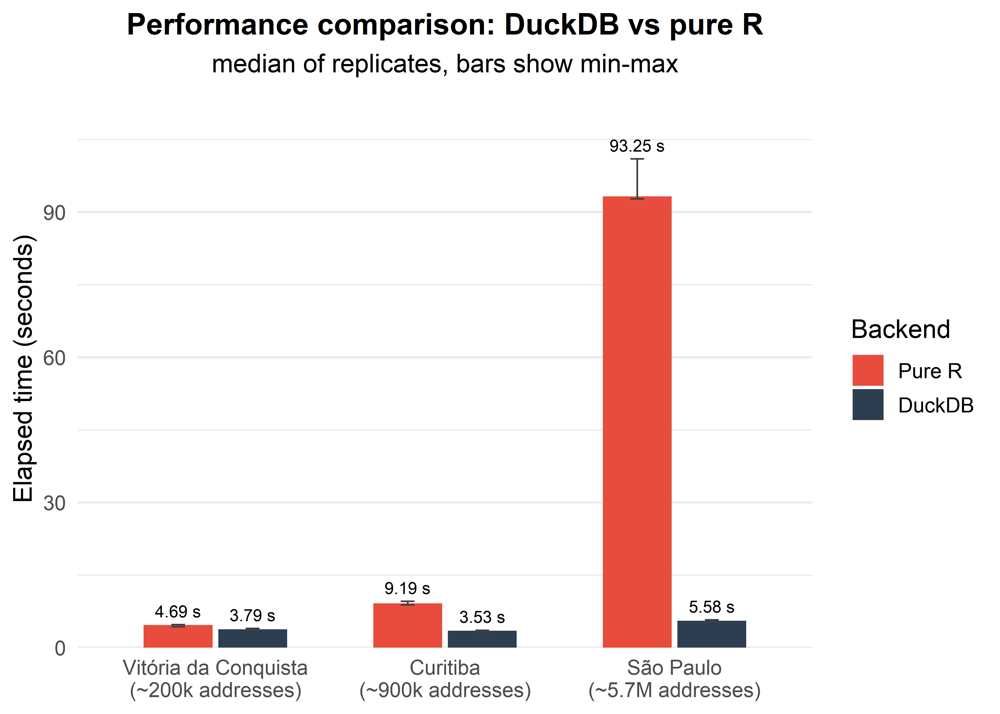
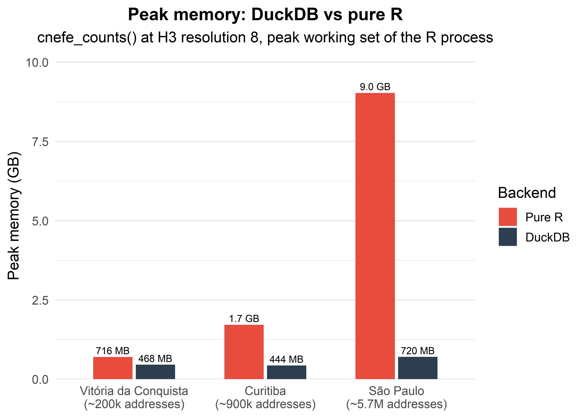
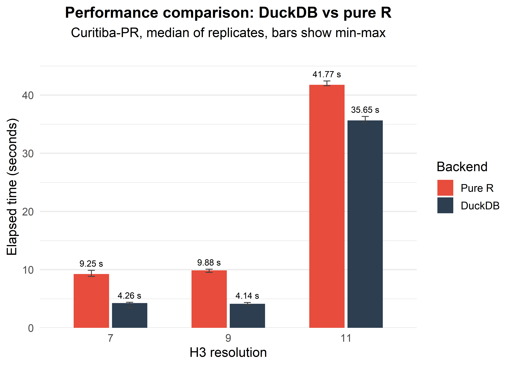

```{r include=FALSE}
# Hidden chunk to ensure pkgdown includes htmlwidget dependencies
library(mapview)
mapview::mapview()
```


## Introduction

Under the hood, **{cnefetools}** uses [DuckDB](https://duckdb.org/) as its
default backend for the heavy work. A pure-R fallback (`backend = "r"`) is
available for environments where DuckDB extensions cannot be installed, using
[h3jsr](https://github.com/obrl-soil/h3jsr) and
[sf](https://r-spatial.github.io/sf/) for the same operations.

Two DuckDB extensions do the work:

-   [**h3**](https://duckdb.org/community_extensions/extensions/h3): assigns
    geographic coordinates to H3 hexagonal grid cells entirely inside DuckDB.
    This is what `cnefe_counts()` and `compute_lumi()` rely on.
-   [**spatial**](https://duckdb.org/docs/stable/core_extensions/spatial/overview):
    performs point-in-polygon joins in SQL. This is what the `tracts_to_*()`
    functions and the user-polygon mode rely on. It is not used by the H3 mode
    benchmarked here.

The cached file itself is a gzipped CSV, which DuckDB decompresses natively, so
no extension is involved in reading it.

This article compares the two backends along two dimensions, using
`cnefe_counts()`: municipality size, measured in both elapsed time and peak
memory, and H3 output resolution.

## How these numbers were produced

Running the same call on the same warm input repeatedly, we measured elapsed
times from 1.63 s to 3.77 s within a single session, with the slow runs at the
end rather than the beginning, and a fresh session minutes later ran uniformly
slower than the first session's early runs. That points to CPU thermal and
frequency drift rather than to a cold page cache, which would have made the
first runs slow instead of the last, or to thread scheduling, since pinning CPU
affinity barely changed anything.

If you time every DuckDB case and then every pure-R case, all of that drift
lands on one backend, where you can't tell it apart from the effect you're
trying to measure. So the measurements here:

-   discard a warm-up run per configuration, so the OS page cache is hot and
    the one-off extension load is already paid;
-   visit every configuration once per pass, round-robin, repeated 3 to 5
    times, so drift becomes noise spread across all configurations rather than
    bias loaded onto one;
-   report the **median** with the observed min-max range, not a single run;
-   run each replicate in a **fresh R subprocess**;
-   record how much CPU the rest of the machine used during each replicate, so
    contention is visible in the data rather than assumed away.

Peak memory is the operating system's peak working set for the whole process,
via `ps::ps_memory_info()`, and not R-level allocation tracking such as
`bench::mark()`'s `mem_alloc`. R-level tracking only counts the R heap, and
DuckDB allocates in C++ outside it, so it would understate DuckDB by a wide
margin.

The raw per-replicate measurements, including the machine-load columns, are in
`data-raw/bench_r2_8.csv` in the package repository, and the harness that
produced them is `data-raw/bench_r2_8.R`.


``` r
library(cnefetools)
library(dplyr)
library(ggplot2)
library(kableExtra)
```


``` r
# Summarising, labelling and plotting live in one place, shared with the
# manuscript's paper/figures/benchmark.R, so the two cannot disagree on a
# speedup, a rounding rule or a label.
source("../../data-raw/bench_r2_8_plots.R")

bench <- bench_load()
bench_med <- bench_summarise(bench)
```

The machine: 14-core, 20-thread Intel Core i9-13900H (2.60 GHz), 32 GB RAM,
Windows 11.


``` r
data.frame(
  component = c("R", "duckdb", "cnefetools"),
  version = c(
    paste0(R.version$major, ".", R.version$minor),
    as.character(packageVersion("duckdb")),
    as.character(packageVersion("cnefetools"))
  )
) |>
  kbl() |>
  kable_styling(full_width = FALSE)
```

<table class="table" style="width: auto !important; margin-left: auto; margin-right: auto;">
 <thead>
  <tr>
   <th style="text-align:left;"> component </th>
   <th style="text-align:left;"> version </th>
  </tr>
 </thead>
<tbody>
  <tr>
   <td style="text-align:left;"> R </td>
   <td style="text-align:left;"> 4.6.0 </td>
  </tr>
  <tr>
   <td style="text-align:left;"> duckdb </td>
   <td style="text-align:left;"> 1.5.2 </td>
  </tr>
  <tr>
   <td style="text-align:left;"> cnefetools </td>
   <td style="text-align:left;"> 0.3.0.9000 </td>
  </tr>
</tbody>
</table>


## Comparing cities of different sizes

`cnefe_counts()` aggregating CNEFE address points to H3 hexagons at resolution
8, across three municipalities of increasing size.

This is the code the harness runs. It is shown rather than executed, because
this article plots from the committed measurements so that it renders without
re-downloading hundreds of megabytes, and so that the numbers here and in the
package's accompanying paper cannot drift apart.


``` r
cods <- c(
  "Vitoria da Conquista-BA" = 2933307,
  "Curitiba-PR"             = 4106902,
  "Sao Paulo-SP"            = 3550308
)

# One replicate. The real harness wraps this in a fresh subprocess, repeats it
# round-robin across all configurations, and records peak memory.
for (backend in c("duckdb", "r")) {
  for (cod in cods) {
    system.time(
      cnefe_counts(
        code_muni = cod,
        h3_resolution = 8,
        backend = backend,
        verbose = FALSE
      )
    )
  }
}
```


``` r
cities <- bench_cities(bench_med)

bench_plot_time(
  cities, city_lbl,
  subtitle = "median of replicates, bars show min-max"
)
```



> **Note:** For smaller municipalities, the DuckDB backend may offer little or
> no speedup over pure R, and can even be slightly slower. DuckDB pays a fixed
> cost to initialise the connection, load the H3 extension and materialise data
> into its in-memory storage before any computation begins. When the dataset is
> small, that setup cost outweighs the gains from its query engine.

### Memory

The gap between the backends is much wider in memory than in time, and it runs
in the direction most readers don't expect.


``` r
bench_plot_memory(
  cities, city_lbl,
  subtitle = "cnefe_counts() at H3 resolution 8, peak working set of the R process"
)
```



The pure-R backend holds the filtered address table in R memory, so its
footprint grows with the number of addresses, while DuckDB streams the CSV and
aggregates as it goes, never materialising the full table, so its footprint
stays roughly flat. On São Paulo the two are more than an order of magnitude
apart.

So `backend = "r"` is not the lightweight option, even though that's the
obvious way to read it. It's there for environments where DuckDB extensions
can't be installed, and on a machine that's short of RAM it's the expensive
choice. What holds DuckDB itself back is the `cnefetools.duckdb_config`
option, which sets its thread count and memory budget:


``` r
options(cnefetools.duckdb_config = list(threads = 4, memory_limit = "4GB"))
```

Left alone, DuckDB sets `memory_limit` to 80% of installed RAM, so it already
asks for less on a smaller machine, and a query that goes over the limit spills
to a temporary directory instead of failing.

## Contrasting three spatial resolutions

The same function on a fixed municipality, Curitiba-PR, across H3 resolutions
7, 9 and 11.


``` r
for (backend in c("duckdb", "r")) {
  for (res in c(7, 9, 11)) {
    system.time(
      cnefe_counts(
        code_muni = 4106902,
        h3_resolution = res,
        backend = backend,
        verbose = FALSE
      )
    )
  }
}
```


``` r
h3res <- bench_med |>
  filter(block == "h3res") |>
  mutate(
    res_lbl = factor(h3_res, levels = sort(unique(h3_res))),
    backend_lbl = bench_backend(backend)
  )

bench_plot_time(
  h3res, res_lbl,
  xlab = "H3 resolution",
  subtitle = "Curitiba-PR, median of replicates, bars show min-max"
)
```



> **Note:** At finer H3 resolutions the hexagons are much smaller, so the H3
> point-to-cell indexing, which both backends ultimately delegate to the same
> underlying H3 C library, dominates the total runtime. Because DuckDB still
> pays its fixed startup cost while the actual computation gets lighter per
> cell, its relative advantage shrinks as resolution rises.

## Conclusions


``` r
bench_med |>
  filter(block == "cities") |>
  mutate(muni = bench_city(muni)) |>
  bench_speedup("muni") |>
  left_join(
    bench_med |>
      filter(block == "cities") |>
      mutate(muni = bench_city(muni)) |>
      distinct(muni, n_addresses),
    by = "muni"
  ) |>
  arrange(muni) |>
  transmute(Municipality = muni, Addresses = n_addresses,
            `DuckDB speedup` = speedup) |>
  kbl() |>
  kable_styling(full_width = FALSE)
```

<table class="table" style="width: auto !important; margin-left: auto; margin-right: auto;">
 <thead>
  <tr>
   <th style="text-align:left;"> Municipality </th>
   <th style="text-align:left;"> Addresses </th>
   <th style="text-align:right;"> DuckDB speedup </th>
  </tr>
 </thead>
<tbody>
  <tr>
   <td style="text-align:left;"> Vitória da Conquista-BA </td>
   <td style="text-align:left;"> ~200k </td>
   <td style="text-align:right;"> 1.14 </td>
  </tr>
  <tr>
   <td style="text-align:left;"> Curitiba-PR </td>
   <td style="text-align:left;"> ~900k </td>
   <td style="text-align:right;"> 2.03 </td>
  </tr>
  <tr>
   <td style="text-align:left;"> São Paulo-SP </td>
   <td style="text-align:left;"> ~5.7M </td>
   <td style="text-align:right;"> 13.29 </td>
  </tr>
</tbody>
</table>


``` r
bench_med |>
  filter(block == "h3res") |>
  bench_speedup("h3_res") |>
  mutate(
    `Mean hexagon area (m2)` = c(5161293.36, 105332.51, 2149.64)[
      match(h3_res, c(7, 9, 11))
    ]
  ) |>
  arrange(h3_res) |>
  transmute(`H3 resolution` = h3_res, `Mean hexagon area (m2)`,
            `DuckDB speedup` = speedup) |>
  kbl() |>
  kable_styling(full_width = FALSE)
```

<table class="table" style="width: auto !important; margin-left: auto; margin-right: auto;">
 <thead>
  <tr>
   <th style="text-align:right;"> H3 resolution </th>
   <th style="text-align:right;"> Mean hexagon area (m2) </th>
   <th style="text-align:right;"> DuckDB speedup </th>
  </tr>
 </thead>
<tbody>
  <tr>
   <td style="text-align:right;"> 7 </td>
   <td style="text-align:right;"> 5161293.36 </td>
   <td style="text-align:right;"> 1.88 </td>
  </tr>
  <tr>
   <td style="text-align:right;"> 9 </td>
   <td style="text-align:right;"> 105332.51 </td>
   <td style="text-align:right;"> 2.02 </td>
  </tr>
  <tr>
   <td style="text-align:right;"> 11 </td>
   <td style="text-align:right;"> 2149.64 </td>
   <td style="text-align:right;"> 1.02 </td>
  </tr>
</tbody>
</table>


How much time DuckDB saves depends on the job. It grows with the number of
address points and shrinks as H3 resolution rises, to the point of disappearing
at resolution 11, where the two backends come within a couple of percent of
each other because H3 indexing dominates and both hand it to the same
underlying C library. On the smallest municipality they're close enough that
the choice doesn't matter much, and in one configuration measured here pure R
came out marginally ahead.

Memory behaves differently. That gap doesn't shrink with resolution and it
widens with municipality size, because only one of the two backends
materialises the address table.

**Recommendation**: use the DuckDB backend, which is the default. The pure-R
backend is there for environments where DuckDB extensions can't be installed,
and choosing it costs far more in memory than it does in time. If you're short
of RAM, set `cnefetools.duckdb_config` instead of switching backends.
